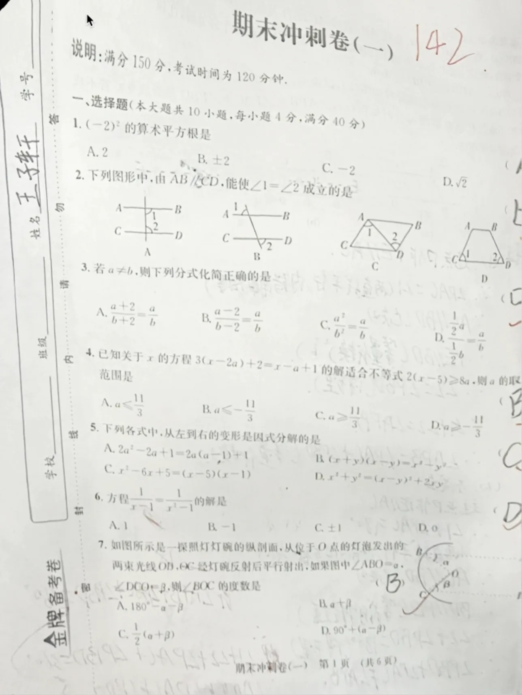
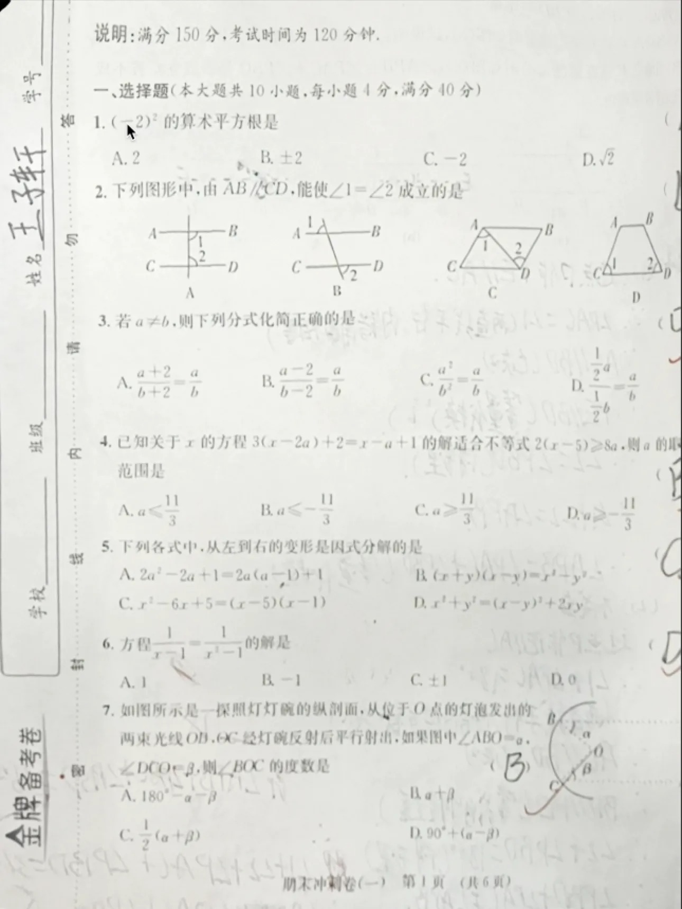

# Introduction
这是一个作者自己基于Control Points进行了一系列优化的矫正模型训练/推理代码，训练数据格式基本与Control Points的数据一致，分别为输入图片与对应的control points（建议参考[control points](https://github.com/gwxie/Document-Dewarping-with-Control-Points)与[造数据方法](https://github.com/gwxie/Synthesize-Distorted-Image-and-Its-Control-Points)）。下面是本方法效果与市面上某产品效果的比对。
|  |  |  |
|:---:|:---:|:---:|
| 输入图片 | 某产品效果 | 我的效果 |

可以看到，当前市面上的某产品效果，会因为矫正丢掉部分边界信息，但我的效果由于对训练数据处理问题，可以保留所有图上的信息，这对很多下游任务（如OCR、版面检测）有相当大的帮助

# Contributes
我的主要贡献如下：
- 优化了原造数据方法，原造数据方法只造了32*32个control points，我新的造数据方法输出了所有像素点的对应位置，使得效果得到了巨大的提升；
- 提供了一种非常fancy的数据处理方式，保证了输入图片的每个像素点都会在输出图片上体现；
- 提供了一些对loss的约束（i.e. 增加了特殊位置的权重），以及对原有loss进行了微调优化；
- 优化了模型结构，将传统UNet换成了Restormer结构。效果有显著提升；

# Discussion
总的来看，本方法使用了较简单的模型（亲测UNet效果也很好），嵌入了fancy的数据处理方式，以及重新改造了generate training data的方法，使得训练数据质量大幅提升，从而模型效果也得到了大幅的增强。

通过经验分析，数据的质量提升为本项目最大的改进点，模型选型上，我只是采用了在图片处理上当时(2024年）较为常用的restormer模型，并未做过多的优化。对loss的约束，属于是对原有方法（control points）的一些错误修正。对于数据的全新预处理方法，是模型能够保留所有信息的关键步骤，但就模型效果而言，贡献不如训练数据的质量提升。

# Tips
训练数据的格式

一个lst文件，文件中的每一行是一个gw文件地址，此代码加载数据可能有点慢，建议大家可以自己写个多进程加载，速度快些。
